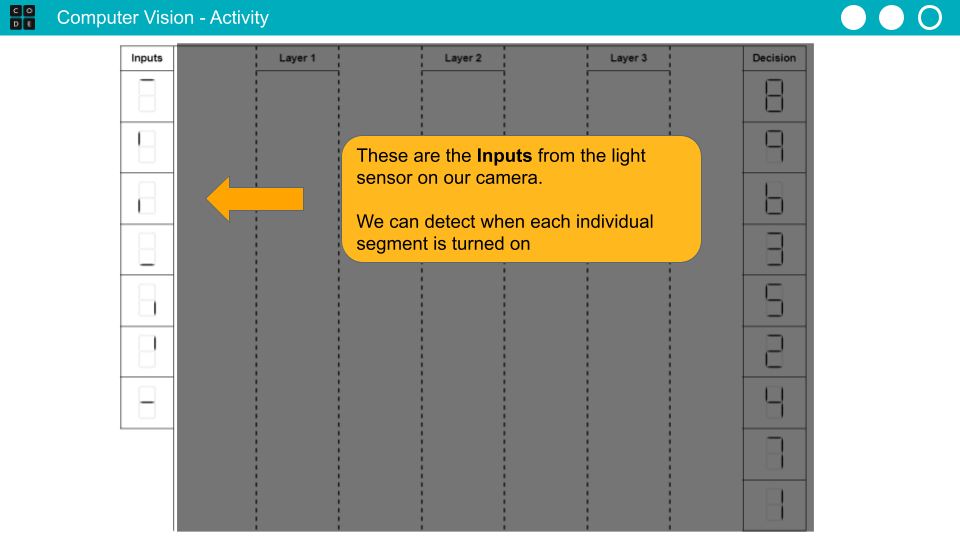
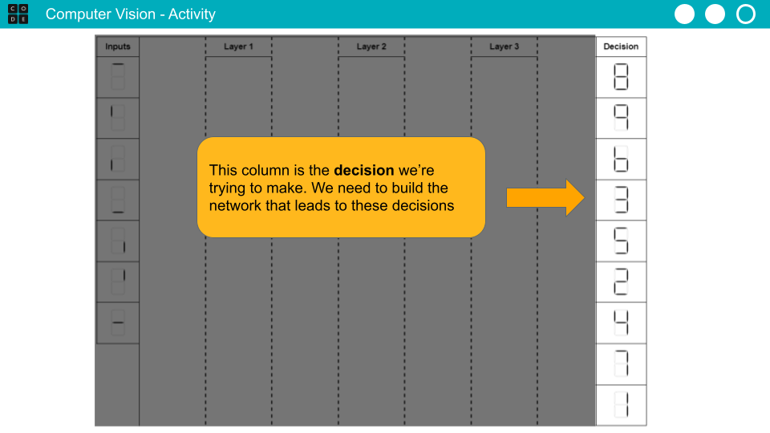
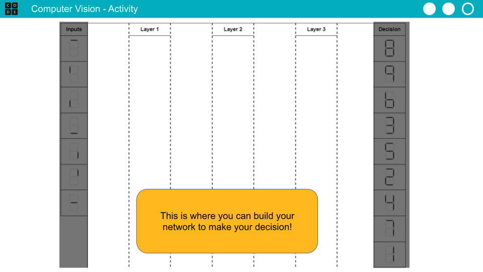
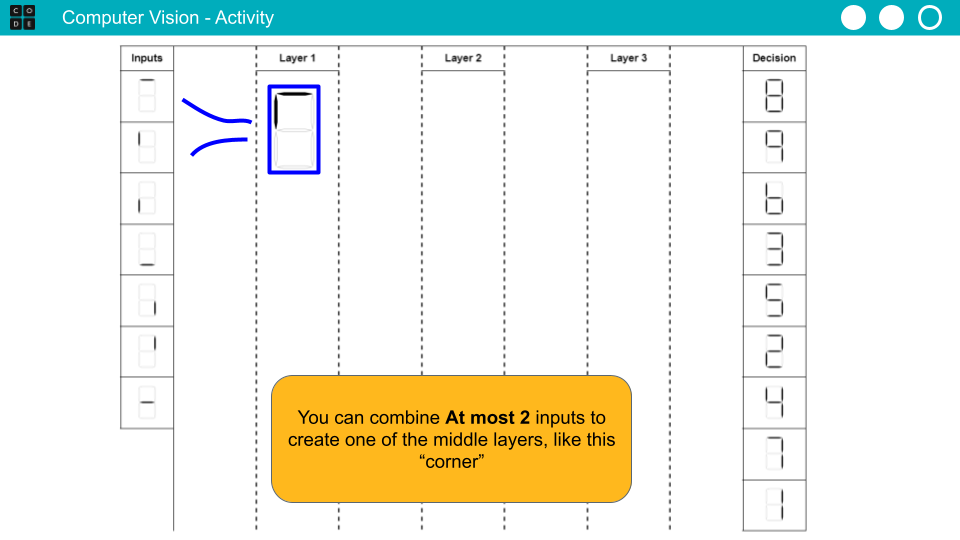
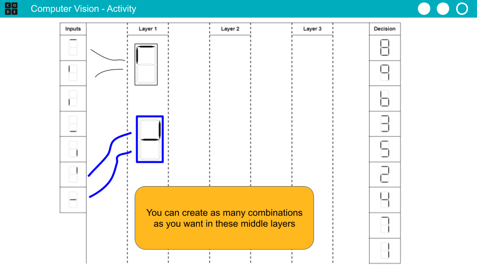
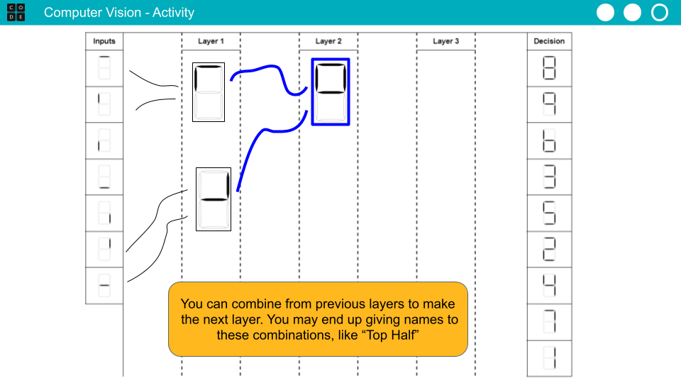
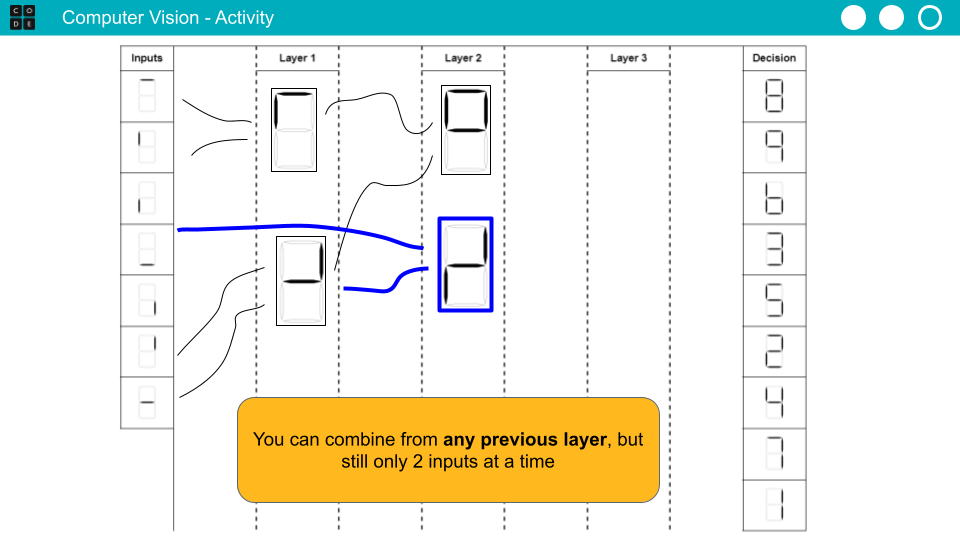
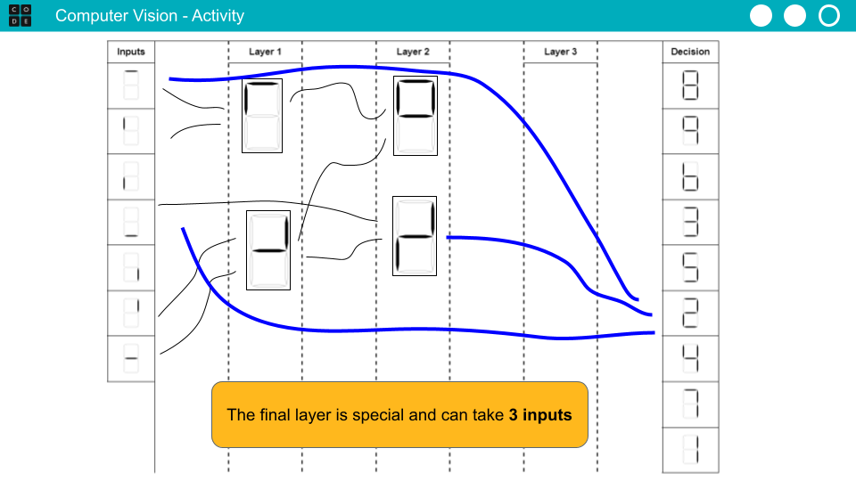

# Computer Vision Lesson Plan



Building blocks:

```markup
<i class="fa fa-pencil" aria-hidden="true"></i> **Vocabulary:** 
<i class="fa fa-refresh" aria-hidden="true"></i> **Circulate:** 
<i class="fa fa-file-text-o" aria-hidden="true"></i> **Distribute:** 
<i class="fa fa-check-square-o" aria-hidden="true"></i> **Do This:** 
<i class="fa fa-lightbulb-o" aria-hidden="true"></i> **Discussion Goal:** 
<i class="fa fa-comments" aria-hidden="true"></i> **Discuss:** 
<i class="fa fa-list-alt" aria-hidden="true"></i> **Display:** 
<i class="fa fa-comments" aria-hidden="true"></i> **Prompt:** 
<i class="fa fa-desktop" aria-hidden="true"></i> **Model:** 
<i class="fa fa-video-camera" aria-hidden="true"></i> **Video:**  
```




[https://docs.google.com/presentation/d/1SNuFGwTR6ZzIL2kCMyiKMte3-kNDihRuOtcspSS72d8/edit](https://docs.google.com/presentation/d/1SNuFGwTR6ZzIL2kCMyiKMte3-kNDihRuOtcspSS72d8/edit)





[https://docs.google.com/document/d/1C7ob1lB-zKi0DSC3do9ZVFfXkHlC2xnSDI2yPFAqEY4/edit](https://docs.google.com/document/d/1C7ob1lB-zKi0DSC3do9ZVFfXkHlC2xnSDI2yPFAqEY4/edit)




### Warm Up (5 mins)

**Display:** Show the image on the slide to students.

 (1).png>)

**Prompt:** _What animal do you see in this image? Write your answer on a sheet of paper_

**Discussion Goal:** After a brief pause, ask students to share out. Students will likely notice one of two animals: either a duck or a rabbit. Once both options are said, students may "switch" back and forth in how they see the image - sometimes it's a duck, sometimes it's a rabbit.

**Prompt:** _If this were an argument and you wanted to convince someone else that your animal is correct, what would you say? What **features** in the image help your argument?_

**Discussion Goal:** This prompt is meant to help students identify the features of the drawing that their eyes noticed to help make that decision. Both arguments will likely identify the black dot in the center as the eye of the animal. Duck arguments will identify the left feature as the bill or mouth of the duck, whereas rabbit arguments will identify those as the ears. Emphasize that students are using specific features to make their decision (ie: eye + ears + mouth = rabbit).

**Display:** Show slide with additional optical illusions

.png>).png>).png>)

> We use our eyes and sense of sight to identify objects, and sometimes an image with identical features can be interpretted in several different ways. But what about a computer - what would it "see" if it saw one of this pictures? Is the dress gold, or is it blue? Is this a young woman looking away, or an old woman looking down? Are these a bunch of dogs, or a bunch of bagels? Today we're going to talk about how computers can "see" and detect images

### Activity (35 minutes)

**Video:** Show the Computer Vision video



**Prompt:** How would you summarize how a computer "sees" something in an image?

**Discussion Goal:** Listen for students describing how it breaks an image into parts, then combines them together in layers to create more complex shapes. Students may rely on the shape visuals from the video, or on the dog and muffin visuals.

**Vocabulary:** Display the slide with vocabulary for today's lesson

* **Algorithm** - a series of steps to solve a problem or make a decision
* **Network** - A collection of items connected together. Following these connections can represent the steps in an algorithm, like a flowchart.

> Today we're going to create our own image recognition **algorithm**. An algorithm is a series of steps to solve a problem or make a decision. We're going to create an algorithm that uses a **network** to make a decision, just like in the video

**Display:** Show the slide with a scoreboard from a baseball game

 (1).png>) (1).png>)

> We're helping a sports arena make its scoreboard more accessible. We want to train a camera to detect what the scores are so it can be broadcast to a radio receive for people who are visually impaired. For this to work, it needs to detect the which number is displayed on the scoreboard. Each number is represented with one of these displays, which uses 7 segments to create images.

**Prompt:** How would you represent your birthday using these numbers? Sketch your answer on a sheet of scratch paper

As students are sketching their responses, begin distributing the activity guide.&#x20;

**Distribute:** Pass out the [Computer Vision Network - Activity Guide](https://docs.google.com/document/d/1C7ob1lB-zKi0DSC3do9ZVFfXkHlC2xnSDI2yPFAqEY4/edit)

\[Teaching Tip] **Going Big:** Consider printing out copies of the 7-segment manipulatives and having students work on whiteboards, poster paper, rolls of butcher paper, or even setting down individual items and connecting them with string or yarn.

**Group:** Group students into pairs to work together

**Display:** Show the slides giving an overview of this activity

| Slides                           | Say                                                                                                                                                                      |
| -------------------------------- | ------------------------------------------------------------------------------------------------------------------------------------------------------------------------ |
|  | **Say:** The left side of this guide represents the inputs that your sensor can detect. It knows when each individual segment is turned on.                              |
|  | **Say:** The right side of this guide represents the decision we're trying to make. We need to build a path from the inputs on the left to these decisions on the right. |
|  | **Say:** This central area is where you can build your network, just like in the video                                                                                   |
|  | **Say:** You can combine at most 2 inputs from previous layers to create a new combination, like this "corner" combined from two segments                                |
|  | **Say:** You can make as many items in this column as you want! For the first layer, you may end up with a lot of combinations in this column                            |
|  | **Say:** You can combine from previous layers to move into the next layers, creating more complex shaps like this "Top Half"                                             |
|  | **Say:** You can combine from any previous layer, but you can still only use 2 inputs at a time                                                                          |
|  | **Say:** The final layer is special - it can combine up to 3 inputs from any of the previous layers                                                                      |

**Do This:** Have students work in pairs to construct their network. The rules for the network are displayed on the slides.

**Circulate:** Monitor students as they complete this task, observing the different strategies students attempt to "move through" the layers. Ensure partners are collaborating together. Look for groups that are creating unique or novel networks , especially when different from some of the examples in the presentation.

\[Teaching Tip] **Why are they out of order?** Students may ask why the numbers are out of order on the right side of the activity guide. They're ordered by "number of segments" - 8 has the most active segments, and 1 does not. When it comes time to make a decision, if multiple numbers are lit up (like 9 and 7 and 4 and 1), then the top number is always chosen. This helps reduce the complexity for students as they make their algorithms - otherwise, an 8 could cause havoc in their network!

\[Teaching Tip] **Exemplar:** A few example networks are provided as an Answer Keys. These can be used as reference, or to quickly inspire students who may be stuck. They can also be used in class discussions to emphasize that there are multiple ways to solve this task.

**Regroup:** Have students regroup

\[Teaching Tip] **(Optional) Gallery Walk:** Consider having students perform a gallery walk to visit other networks, and have students reflect on how the networks are similar or different from their own. This is an especially engaging activity if students have "Gone Big" and drafted their networks on whiteboards or poster paper.

> Now that we have our algorithm, lets test it! We're going to do 2 examples. I'm going to show a slide that has certain inputs covered with post-it notes. This means the sensor detected that particular strand was lit up. Follow your network to determine which number it is!

**Display:** Display the slide with the first example

\[Teaching Tip] **Use the network, not your eyes:** Students may comment that, once they have the inputs on the left-side, they already know what number it is - they can "figure it out just by looking at it". Remind students that the goal isn't for _**us**_ to figure it out with our eyes and brain, but for a _**computer**_ to figure it our with its sensors and algorithm. You can also ask students to consider all of the steps that happened in nanoseconds once they saw these inputs - their brain needed to combine all of this information together to know what number it was. This network is doing the same thing, acting like the computer's "brain" to make a decision once it sees the inputs.

**Circulate:** Monitor students as they trace the path in their network

**Prompt:** _Are there any changes you want to make to your network? You have a minute to do so!_

**Display:** Show the slide with the second example

\[Teaching Tip] **Optional Extensions:**

* Consider having students trade networks with another pair, then giving students a third example and seeing if they can trace a neighbor's network
* Consider inviting students to trace the solution in front of the class, explaining how their network works
* Consider giving students the number 8 as an input, which will activate every single space in their network, then prompt them to consider how they can make a decision when this happens

### Wrap Up (5 mins)

**(Option 1) Prompt:** _How would you adapt your network to work with a 14-segment display? What would need to change?_

 (1).png>)

**(Option 2) Prompt:** _Imagine one of the segments is burnt out so the following image is displayed. What number do you think it is? What number will your network say it is?_


**Discussion Goal:** Could be 3 or 9

**(Option 3) Prompt:** What do you imagine a network could look like that could identify the image below? What do the inputs look like? What do some of the middle layers look like?

.png>)

**(Optional) Extension:** Consider watching the What a Neural Network Sees video from the [Experiments with Google](https://experiments.withgoogle.com/what-neural-nets-see) page. The short video gives a live example of how image classification works as a neural network, where you can see the inputs and hidden layers.


