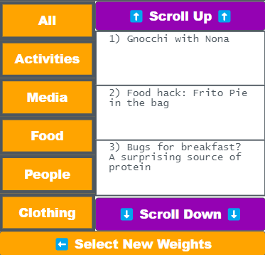

# Computer Vision Lesson Plan



Building blocks:

```
<i class="fa fa-pencil" aria-hidden="true"></i> **Vocabulary:** 
<i class="fa fa-refresh" aria-hidden="true"></i> **Circulate:** 
<i class="fa fa-file-text-o" aria-hidden="true"></i> **Distribute:** 
<i class="fa fa-check-square-o" aria-hidden="true"></i> **Do This:** 
<i class="fa fa-lightbulb-o" aria-hidden="true"></i> **Discussion Goal:** 
<i class="fa fa-comments" aria-hidden="true"></i> **Discuss:** 
<i class="fa fa-list-alt" aria-hidden="true"></i> **Display:** 
<i class="fa fa-comments" aria-hidden="true"></i> **Prompt:** 
<i class="fa fa-desktop" aria-hidden="true"></i> **Model:** 
<i class="fa fa-video-camera" aria-hidden="true"></i> **Video:**  
```




[https://docs.google.com/presentation/d/1SNuFGwTR6ZzIL2kCMyiKMte3-kNDihRuOtcspSS72d8/edit](https://docs.google.com/presentation/d/1SNuFGwTR6ZzIL2kCMyiKMte3-kNDihRuOtcspSS72d8/edit)





[https://docs.google.com/document/d/1C7ob1lB-zKi0DSC3do9ZVFfXkHlC2xnSDI2yPFAqEY4/edit](https://docs.google.com/document/d/1C7ob1lB-zKi0DSC3do9ZVFfXkHlC2xnSDI2yPFAqEY4/edit)




### Warm Up (5 mins)

**Display:** Show the image on the slide to students.

.png>)

**Prompt:** _What animal do you see in this image? Write your answer on a sheet of paper_

**Discussion Goal:** After a brief pause, ask students to share out. Students will likely notice one of two animals: either a duck or a rabbit. Once both options are said, students may "switch" back and forth in how they see the image - sometimes it's a duck, sometimes it's a rabbit.

**Prompt:** _If this were an argument and you wanted to convince someone else that your animal is correct, what would you say? What **features** in the image help your argument?_

**Discussion Goal:** This prompt is meant to help students identify the features of the drawing that their eyes noticed to help make that decision. Both arguments will likely identify the black dot in the center as the eye of the animal. Duck arguments will identify the left feature as the bill or mouth of the duck, whereas rabbit arguments will identify those as the ears. Emphasize that students are using specific features to make their decision (ie: eye + ears + mouth = rabbit).

**Display:** Show slide with additional optical illusions

.png>).png>)

> We use our eyes and sense of sight to identify objects, and sometimes an image with identical features can be interpretted in several different ways. But what about a computer - what would it "see" if it saw one of this pictures? Is the dress gold, or is it blue? Is this a young woman looking away, or an old woman looking down? Are these a bunch of dogs, or a bunch of bagels? Today we're going to talk about how computers can "see" and detect images

### Activity (35 minutes)

**Video:** Show the Computer Vision video



**Prompt:** How would you summarize how a computer "sees" something in an image?

**Discussion Goal:** Listen for students describing how it breaks an image into parts, then combines them together in layers to create more complex shapes. Students may rely on the shape visuals from the video, or on the dog and muffin visuals.

**Vocabulary:** Display the slide with vocabulary for today's lesson

* **Algorithm** - a series of steps to solve a problem or make a decision
* **Network** - A collection of items connected together. Following these connections can represent the steps in an algorithm, like a flowchart.

> Today we're going to create our own image recognition **algorithm**. An algorithm is a series of steps to solve a problem or make a decision. We're going to create an algorithm that uses a **network** to make a decision, just like in the video

**Display:** Show the slide with a scoreboard from a baseball game

.png>).png>)

> We're helping a sports arena make its scoreboard more accessible. We want to train a camera to detect what the scores are so it can be broadcast to a radio receive for people who are visually impaired. For this to work, it needs to detect the which number is displayed on the scoreboard. Each number is represented with one of these displays, which uses 7 segments to create images.

**Prompt:** How would you represent your birthday using these numbers? Sketch your answer on a sheet of scratch paper

As students are sketching their responses, begin distributing the activity guide.&#x20;

**Distribute:** Pass out the [Computer Vision Network - Activity Guide](https://docs.google.com/document/d/1C7ob1lB-zKi0DSC3do9ZVFfXkHlC2xnSDI2yPFAqEY4/edit)

**Display:** Show the slides giving an overview of this activity

| Slides                           | Say                                                                                                                                                                      |
| -------------------------------- | ------------------------------------------------------------------------------------------------------------------------------------------------------------------------ |
|  | **Say:** The left side of this guide represents the inputs that your sensor can detect. It knows when each individual segment is turned on.                              |
|  | **Say:** The right side of this guide represents the decision we're trying to make. We need to build a path from the inputs on the left to these decisions on the right. |
|  | **Say:** This central area is where you can build your network, just like in the video                                                                                   |
|  | **Say:** You can combine at most 2 inputs from previous layers to create a new combination, like this "corner" combined from two segments                                |
|  | **Say:** You can make as many items in this column as you want! For the first layer, you may end up with a lot of combinations here.                                     |
|  | **Say:**                                                                                                                                                                 |
|  |                                                                                                                                                                          |
|  |                                                                                                                                                                          |

